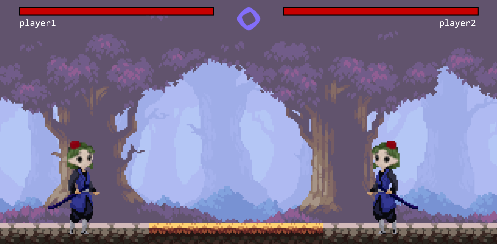

# Devnads Fight Club

**Devnads Fight Club** is a pixel-art multiplayer fighting game built with **Kaboom.js**, **Multisynq**, and **Ethers.js**. Players connect using their MetaMask wallets and battle each other in real-time after entering a match, which is recorded on the Monad Testnet blockchain.

---

## 🎮 Game Features

- 2-player real-time combat
- Health bars, ping display, animations (idle, run, jump, attack, death)
- Web3 integration with MetaMask
- Match tracking on Monad Testnet
- Responsive pixel-art UI using Kaboom.js
- Multiplayer synchronization via Multisynq

---

## 🧱 Project Structure

- `index.html`:  
  The landing page where players connect their wallet and enter a match. Once a transaction is confirmed on the blockchain, they are redirected to the game.

- `game.html`:  
  The core game page. It handles all visuals, gameplay logic, synchronization, and animation using Kaboom.js and Multisynq.

- `gamess.png`:  
  A screenshot of the in-game battle view, showing two characters, health bars, and the background.

---

## 🛠️ How to Run

1. Clone the repository and place all assets in a folder:
