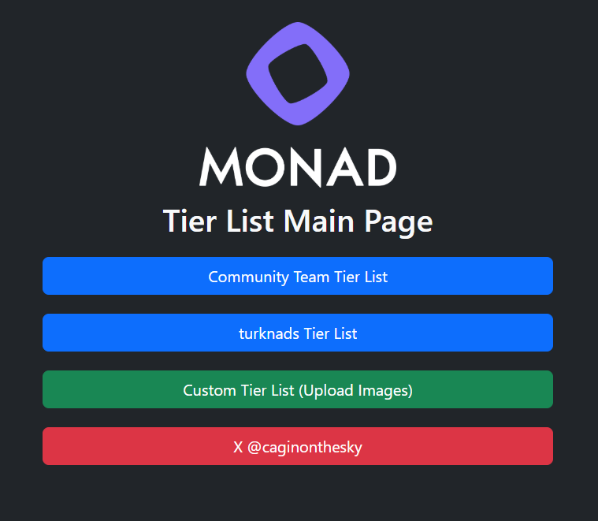

# 🧠 MONAD Tier List Tool

A simple web-based tool to create and explore tier lists — for the Monad community and beyond.

## 🚀 Features

- 🧑‍🤝‍🧑 **Community Team Tier List** – View the official community team rankings.
- 🇹🇷 **turknads Tier List** – Explore rankings tailored by the Turkish Monad community.
- 🖼️ **Custom Tier List** – Upload your own images and create a personalized tier list.
- 🔗 Follow us on [X / Twitter](https://twitter.com/caginonthesky)

## 🌐 Live Demo

> You can try the app [here](https://cagin.xyz/tierlist) *(if deployed)*

## 🛠️ Tech Stack

- HTML + CSS (Vanilla)
- JavaScript
- [SortableJS](https://github.com/SortableJS/Sortable) (for drag-and-drop functionality)

## 📁 Project Structure

